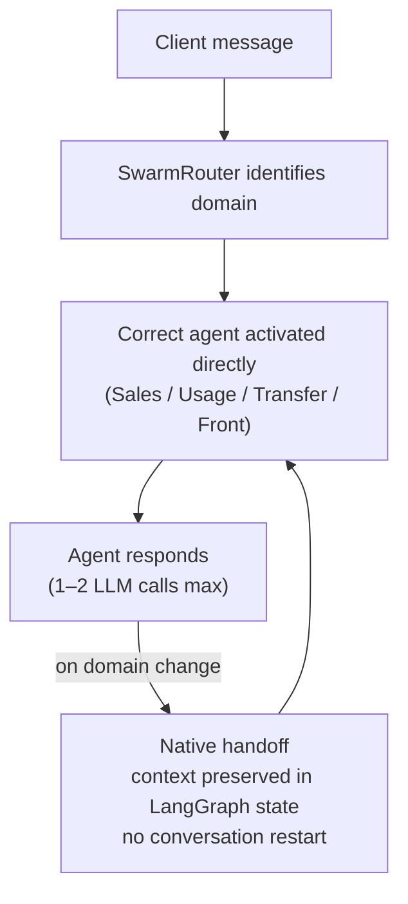

# Projects

Four systems I've designed and shipped to production, all currently running. Each one is a different answer to the same underlying question: how do you put an LLM in front of real users without the latency, cost, or reliability problems eating the value.

## Conversational AI assistant

LangGraphKubernetesAzure OpenAIFastAPI

Boulanger's legacy chatbot was a static decision tree (Dialogflow). I led the design and build of its replacement: a generative AI assistant covering the full customer journey — product discovery, order tracking, after-sales, human escalation — live on the website and mobile app since October 2025.

~2,000<small>conversations / day</small>
73–75%<small>resolved without escalation</small>
78%<small>positive satisfaction</small>
~2.4s<small>average latency</small>

**The core problem was latency, and the fix was architectural, not a prompt tweak.** A naive multi-agent system routes every message through a central orchestrator that calls an LLM just to decide who handles it, then calls the agent, then formats the output — every hop adds latency. Instead:

Routing and handoffs are native to the graph — no external classifier, no extra orchestration layer. The number of LLM calls per message stays minimal by design.

!!! tip "More on this"
    I wrote up the general principle behind this decision in [Latency is an architecture problem, not a prompt problem](writing/2026-08-14-latency-is-an-architecture-problem.md).

**What else went into making it production-grade:**

- **Fully async, end to end** — FastAPI + Motor (async MongoDB) + httpx, so no request blocks a worker thread during an LLM call, a DB write, or an internal API request. Sized Kubernetes ReplicaSets and resource limits to absorb concurrent load.
- **A security layer inside the graph itself** — prompt-injection detection and off-scope content filtering at the router level, before any agent runs; strict per-agent tool isolation so an agent can only call what it owns.
- **Structured output over free text for anything factual** — `model.with_structured_output(...)` for product identifiers, separating offers from prose. Removes an entire class of hallucination on things that must be exact.
- **Native interrupt/resume for multi-step escalation** — when a conversation needs a human, LangGraph's `@interrupt` pauses it, the client picks a channel, and `Command(resume=...)` continues from the exact same state. No context loss.
- **Prompts as versioned Markdown, not embedded strings** — split by domain (system / shared / tools), loaded with `@lru_cache`. A prompt change is a merge and a redeploy, not a code change. Quality is tracked continuously with **Langfuse** LLM-judge scoring against production traffic.
- **A real API contract negotiation** — 12 polymorphic content types (text, product carousels, link cards, escalation actions) co-designed with the web, iOS, and Android teams so every channel renders the same conversation correctly.

The chatbot now covers the entire customer journey — 26% after-sales, 22% pre-purchase advice, 17% order management, the rest split across FAQ, delivery, billing, and loyalty — and has become the reference pattern for every new AI touchpoint at the company.

---

## Self-BI — natural language over Snowflake

MCPGoogle ADKVertex AISnowflake

Business teams — digital, commerce, retail — needed to query Snowflake data without waiting on a data analyst. Snowflake's native self-service BI was too costly to roll out broadly and assumes every user has a Snowflake account, which most don't.

**The design:** build an MCP server that exposes Snowflake's query and semantic-search capabilities, then deploy business-specific agents on **Gemini Enterprise** — the interface these teams already use every day. No new tool to learn, no Snowflake account required.

A deliberate call was made *against* using each user's personal Snowflake credentials via OAuth: personal accounts often carry broader privileges than an AI agent should ever be able to exercise, and not every user has one anyway. Instead, each use case gets a dedicated service account bound to a **read-only, narrowly scoped Snowflake role**.

!!! note "Security is enforced at four independent layers, so a single failure doesn't expose data"
    1. API gateway authentication (Gravitee) — no valid subscription plan, no access to the MCP server at all
    2. Mandatory service headers validated by the MCP middleware before any tool executes
    3. SQL statement-type enforcement (via `sqlglot`) — only `SELECT` / `DESCRIBE` / `SHOW` ever reach Snowflake
    4. Read-only Snowflake role scoped to the specific use case's tables — even a hallucinated query targeting the wrong table is rejected at the database layer

**The trickiest engineering problem wasn't the agent — it was connectivity.** Vertex AI Agent Engine runs on public GCP infrastructure; the MCP server lives on Boulanger's private network, unreachable from the internet. Solved with three layers: a GCP Private Service Connect attachment so traffic never touches the public internet, a WAF whitelist for the outbound NAT IP, and a conditional HTTP proxy factory so the exact same code path works unchanged in local development and in production.

The agent's domain knowledge — table schemas, business aliases, critical filtering rules, standard metric definitions — lives in a 22KB system prompt, so it never needs to perform schema discovery at query time. It also never surfaces raw SQL or technical table names to the end user; everything is translated into business language.

---

## Vox — voice callbot API

Hexagonal architectureSSE streamingLangGraph

Extending the conversational assistant to the phone channel. An external partner handles telephony and speech-to-text/text-to-speech; Vox is the backend that receives the transcribed customer utterance, streams back a response token by token, and returns a control signal (continue, end, escalate to a human).

Voice changes the constraints completely. Latency that was merely important on web becomes **critical** on a phone call — the text-to-speech engine has to start speaking before the LLM has finished generating. That reshaped the entire design:

| | Web chatbot | Vox |
|---|---|---|
| Escalation routing | LLM classification | **Deterministic hard rules — zero LLM calls** |
| Response length | Long, detailed | **≤200 tokens** — short phrases suited to speech |
| Streaming | None | **Token-by-token SSE**, so TTS can start immediately |
| Architecture | Layered | **Hexagonal** (ports & adapters) |

**Hard rules run before any LLM call.** A pure, I/O-free node checks for explicit human requests, backend unavailability, or end-of-conversation keywords, and short-circuits straight to a control signal when one matches — skipping an LLM round-trip entirely on exactly the paths where latency matters most.

**The domain layer never imports a framework.** Everything depends on `Protocol`-based ports (`DeliveryInfoPort`, `AftersalesInfoPort`, `PurchaseHistoryPort`, ...), with concrete adapters plugged in at the edges. Swapping a backend API means writing a new adapter — zero changes inside the agent logic itself, and the domain can be tested with plain async lambdas instead of real I/O.

**Streaming is the central engineering problem.** Each turn emits a sequence of typed SSE events — `conversation_started`, a stream of `text_delta` frames, `message_done`, then a final `control` event — with `X-Accel-Buffering: no` to stop any intermediate proxy from buffering the stream and defeating the whole point. Time-to-first-byte is tracked in Langfuse as a first-class production metric, not an afterthought.

Design decisions learned the hard way on the web chatbot were carried over deliberately from day one: bearer tokens live in the LangGraph runtime context, never in the checkpointed state, so they can't leak into traces or across sessions; adapters fetch concurrently (`asyncio.gather`) and only re-fetch when the underlying data actually changed.

---

## Internal agents — Google Chat & Gemini Enterprise

Vertex AI Agent EngineCloud RunRAG

A third distribution channel for AI agents inside the company, reaching collaborators who use neither the customer-facing site nor Gemini Enterprise: **Google Chat**, the internal communication tool everyone already has open.

A Cloud Run service bridges Google Chat's event webhooks to a Vertex AI Agent Engine agent backed by **Data Stores** — Google's managed RAG layer, which handles ingestion, chunking, embedding, and retrieval over documents supplied directly by the business teams, with no custom pipeline to build or maintain.

The first agent deployed this way is an **official HR assistant**, built in direct collaboration with Boulanger's HR team: they own the content, the scope, and response validation; I own the technical build and deployment. It answers common HR questions around the clock, grounded exclusively in official HR documentation, with no need to escalate routine questions to the HR team.

The underlying pattern — a business-owned agent, a managed retrieval layer, and a distribution surface the target users already have — is now being formalized into a reusable Terraform template, so a new departmental agent can be provisioned (Cloud Run + Chat App + Agent Engine + Data Stores) in a handful of commands rather than a manual console build.
