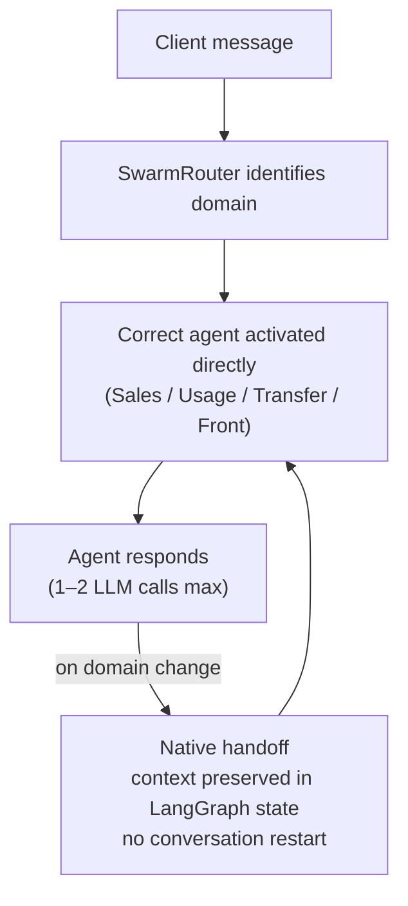

# Projects

Four systems I've designed and shipped to production, all currently running at Boulanger, one of France's largest electronics retailers. Each is written up the way I'd want to read it: what was at stake, the decisions that mattered — including the things I said no to — and what actually changed.

## Customer AI assistant — web & mobile

LangGraphKubernetesAzure OpenAIFastAPI

### The stakes

Boulanger's customer chat ran on a static decision tree (Dialogflow) — the kind of bot customers learn to route around. The bet: replace it with a generative assistant good enough to become a real customer channel, on the website and mobile app, for the *entire* journey — product advice, order tracking, after-sales, human escalation. I led it end to end: architecture, development, Kubernetes deployment, API exposure, security, response quality, and the business relationship. Six months from first commit to production, live since October 2025.

~2,000<small>conversations / day</small>
73–75%<small>resolved without escalation</small>
78%<small>satisfaction · 10,450 ratings</small>
~2.4s<small>average latency</small>

### The decision that shaped everything: no orchestrator

A naive multi-agent system routes every message through a central orchestrator that calls an LLM just to decide who handles it, then calls the agent, then formats the output — every hop adds latency and cost. I designed the swarm so routing and handoffs are native to the graph itself:

No external classifier, no orchestration layer, minimal LLM calls per message by construction. The ~2.4s average latency is what one model call plus tools plus formatting costs — the architecture's job is to never add a superfluous call on top of it.

!!! tip "More on this"
    I wrote up the general principle in [Latency is an architecture problem, not a prompt problem](writing/2026-08-14-latency-is-an-architecture-problem.md).

### The other decisions that mattered

- **Fully async, end to end** — FastAPI + Motor (async MongoDB) + httpx, so no request blocks a worker during an LLM call, a DB write, or an internal API request. Kubernetes ReplicaSets and resource limits sized against real concurrent load.
- **Security inside the graph, not bolted on** — prompt-injection detection and off-scope filtering at the router, before any agent runs; strict per-agent tool isolation so an agent can only call what it owns.
- **Structured output for anything factual** — typed, validated responses for product identifiers, with offers separated from prose. Removes an entire class of hallucination on things that must be exact.
- **Native interrupt/resume for escalation** — when a conversation needs a human, the graph pauses, the customer picks a channel (live chat or scheduled callback), and the conversation resumes from the exact same state. No context loss, no starting over.
- **Prompts as versioned Markdown, not embedded strings** — a prompt change is a merge and a redeploy, not a code change. Quality is tracked continuously with **Langfuse** LLM-judge scoring against production traffic.
- **The API contract was negotiated, not decreed** — 12 polymorphic content types (text, product carousels, link cards, escalation actions, end-of-conversation states) co-designed across many workshops with the web, iOS, and Android teams. Each client declares what it can render; the assistant adapts. This was the longest part of the project, and the reason all three channels render the same conversation correctly.

### What it changed

The assistant covers the entire customer journey — 26% after-sales, 22% pre-purchase advice, 17% order management, the rest across FAQ, delivery, billing, and loyalty. The honest read on the ~25% escalation rate: a large share is *structural* — order cancellations and modifications that no system could self-serve because the internal API doesn't exist yet (it's in development). The assistant diagnoses those correctly and routes them to the right human.

The larger outcome is organizational. **In twelve months, the chat went from an isolated AI project to a company reflex: every new IT project at Boulanger now ships a chat facet as a baseline requirement** — order selfcare and retail media integrations are arriving in the channel next. That's the difference between delivering a system and creating a channel, and it's become the reference pattern for every new AI touchpoint at the company.

---

## Self-BI — natural language over Snowflake

MCPGoogle ADKVertex AISnowflake

### The stakes

Business teams — digital, commerce, retail stores — needed answers from the data warehouse without waiting on a data analyst. Every path to that runs through an uncomfortable trade-off between access and control. This project is mostly a story about which options I turned down.

### What I said no to

**No to Snowflake's native self-service BI.** Too costly to roll out at company scale, and it assumes every user has a Snowflake account — most don't and never will.

**No to OAuth with users' personal credentials.** Personal accounts inherit privileges far broader than anything an AI agent should be able to exercise, and again — most target users have no account at all. Instead: one dedicated service account per use case, bound to a **read-only Snowflake role scoped to exactly that use case's data**.

### What I built instead

An **MCP server** exposing Snowflake's query and semantic-search capabilities, consumed by business-specific agents on **Gemini Enterprise** — the interface these teams already use daily. No new tool to learn, no Snowflake account required, no training rollout.

!!! note "Security is four independent layers, so no single failure exposes data"
    1. API gateway authentication — no valid subscription plan, no access to the MCP server at all
    2. Mandatory service headers validated by MCP middleware before any tool executes
    3. SQL statement-type enforcement — only read statements ever reach Snowflake, parsed and verified, not trusted
    4. A read-only Snowflake role scoped to the use case — even a hallucinated query against the wrong table is rejected by the database itself

This is what "assume the model will be wrong" looks like in practice: the agent can hallucinate all it wants; the blast radius is a rejected query.

### The hard part nobody plans for: connectivity

Vertex AI Agent Engine runs on public GCP infrastructure; the MCP server lives on the company's private network, unreachable from the internet. Solved in three layers — a GCP Private Service Connect attachment so traffic never touches the public internet, a WAF whitelist for the outbound NAT IP, and a conditional HTTP proxy factory so the exact same code runs unchanged on a laptop and in production.

### Design choices worth stealing

The agent's domain knowledge — schemas, business aliases, critical filter rules, standard metric definitions — lives in a 22KB system prompt, so it never performs schema discovery at query time. And it never surfaces raw SQL or technical table names to the user: everything is translated into business language. The first use case (customer analytics) is live with digital, commerce, and store teams; each new use case is a new role, a new semantic schema, the same platform.

---

## Vox — voice callbot API

Hexagonal architectureSSE streamingLangGraph

### The stakes

Extending the assistant to the phone. An external partner handles telephony and speech-to-text/text-to-speech; Vox is the backend that receives the transcribed utterance, streams the response token by token, and returns a control signal — continue, end, or escalate to a human.

On the web, latency is a metric. **On a phone call, latency is silence** — and the text-to-speech engine has to start speaking before the model has finished generating. That single constraint reshaped every layer:

| | Web assistant | Vox |
|---|---|---|
| Escalation routing | LLM classification | **Deterministic hard rules — zero LLM calls** |
| Response length | Long, detailed | **≤200 tokens** — short phrases built for speech |
| Streaming | Optional | **Token-by-token SSE**, so TTS starts immediately |
| Architecture | Layered | **Hexagonal** (ports & adapters) |

### The decisions that mattered

- **Hard rules run before any LLM call.** A pure, I/O-free node checks for explicit human requests, backend unavailability, and end-of-conversation signals, and short-circuits straight to a control signal — skipping an entire LLM round-trip on exactly the paths where latency matters most.
- **The domain layer never imports a framework.** Everything depends on protocol-based ports with concrete adapters at the edges. Swapping a backend API means writing one adapter — zero changes to agent logic — and the domain tests run with plain async fakes instead of real I/O.
- **Streaming is treated as the product, not a feature.** Each turn emits a typed event sequence — conversation start, a stream of text deltas, completion, then a final control event — with anti-buffering headers so no intermediate proxy defeats the point. Time-to-first-byte is a first-class production metric in Langfuse, not an afterthought.
- **Lessons from the web assistant applied on day one, by design:** bearer tokens live in the runtime context, never in checkpointed state, so they can't leak into traces or across sessions; adapters fetch concurrently and only re-fetch when the underlying data actually changed.

This is what a second system looks like when the first one taught you where the bodies are buried.

---

## Internal agents — Google Chat & Gemini Enterprise

Vertex AI Agent EngineCloud RunRAG

### The stakes

Customer-facing AI was live; the company's own employees had none. The third distribution channel targets people who use neither the customer site nor Gemini Enterprise: **Google Chat**, the internal messaging tool everyone already has open. The thesis — every surface the company already uses becomes an entry point for agents — is the same pattern each time: a business-owned agent, a managed retrieval layer, a distribution surface with zero adoption cost.

### What I built

A Cloud Run service bridges Google Chat's event webhooks to a Vertex AI Agent Engine agent backed by **Data Stores** — Google's managed RAG layer, which handles ingestion, chunking, embedding, and retrieval over documents supplied directly by the business teams. No custom RAG pipeline to build, run, or debug at 2am.

### The operating model is the interesting part

The first agent live on the channel is the **company's official HR assistant**, built in direct collaboration with the HR team — and they are its product owner in the full sense: they own the content, the scope, and response validation. I own the technical build and deployment. It answers routine HR questions around the clock, grounded exclusively in official HR documentation, and it works because the people accountable for HR answers control what the agent is allowed to say.

### From project to platform

The pattern is being formalized into a reusable Terraform template — Cloud Run, Chat app, Agent Engine, Data Stores, IAM — so provisioning the *next* departmental agent is a handful of commands instead of a console build. That's the quiet goal of all four projects on this page: each one starts as a delivery and ends as a capability the organization can repeat without me.
