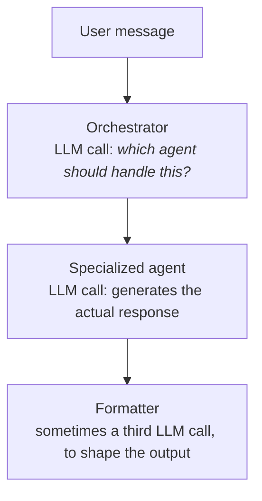
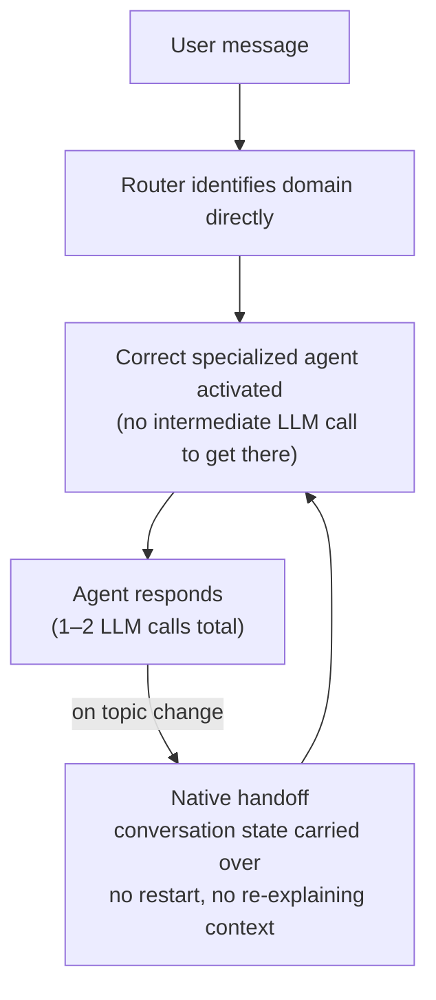

# Latency is an architecture problem, not a prompt problem

`2026-08-14`

Most teams shipping their first multi-agent LLM system reach for the same fix when latency becomes a problem: trim the prompt, switch to a faster model, cache more aggressively. Those help at the margins. They rarely fix the actual problem, because the actual problem is usually structural, not textual.

## The naive shape almost everyone starts with

A common first design for routing a user message to the right specialized agent looks like this:

It's a reasonable design on a whiteboard — separation of concerns, one job per node. In production, it means **every single message pays for two or three sequential LLM round-trips before the user sees a token**, even for something as simple as "what are your opening hours."

!!! tip "The tell"
    If your latency budget is dominated by "time waiting for an LLM to decide something," before any LLM call that actually helps the user, you're paying an architecture tax — not a prompt tax.

## What changes when routing is native, not delegated

The fix that actually moved the needle on a production conversational assistant handling several thousand conversations a day wasn't a better router prompt. It was removing the router's LLM call entirely for the common case:

The router still exists — it still has to figure out which agent should own a message. What changed is *how* it decides: deterministic signal matching and graph-native routing where possible, instead of asking a general-purpose LLM to classify intent on every single turn. The handoff between agents, when a conversation genuinely changes topic mid-flow, is also native to the orchestration graph rather than a fresh LLM call bolted on top — so switching agents doesn't mean losing the conversation's accumulated context.

The result: most messages resolve in **one to two LLM calls total**, down from three or more. That's not a 10% latency improvement from a leaner prompt — it's removing a whole category of round-trip.

## Why this is easy to miss

Prompt-level optimization is visible and satisfying: you can diff two prompts, run an eval, see a number move. Architectural latency is invisible until you actually trace a request end to end and count how many times you're calling out to a model before anything useful happens. It's also easy to under-count, because "just one more classification step" always looks cheap in isolation — it's the sum across the whole conversation flow that hurts.

The practical habit that catches this: before optimizing any single prompt, draw the actual sequence of LLM calls a real message triggers, node by node, including the ones that feel like plumbing (classification, formatting, validation). If more than one of those nodes is a full LLM call and could plausibly be a rule, a smaller/cheaper model, or a native part of the orchestration layer instead — that's where the latency budget is actually going.

## Where this doesn't apply

This isn't an argument against ever using an LLM to route. Genuinely ambiguous, open-ended intent classification across a large number of possible destinations often *does* need a model's judgment — a hard-coded ruleset won't scale to that. The distinction that matters is between routing decisions that are **inherently ambiguous** (worth an LLM call) and ones that are **incidentally implemented as an LLM call** because it was the fastest way to prototype the system. The second category is where the free latency wins live, and in most production systems I've seen, it's a larger category than teams expect going in.
